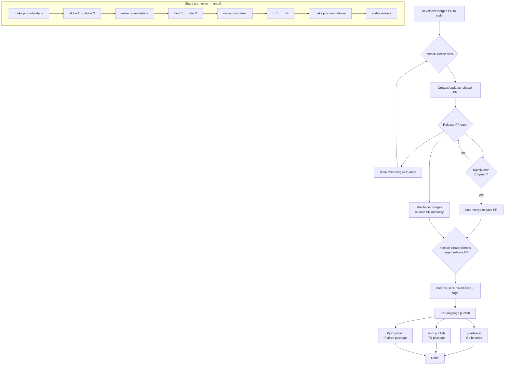

# Releasing

## Flow



## Version Lifecycle

```
0.4.0-alpha.1 -> .2 -> ... -> 0.4.0-beta.1 -> .2 -> ... -> 0.4.0-rc.1 -> .2 -> ... -> 0.4.0
```

| Stage   | Audience     | API              | Breaking changes     |
|---------|--------------|------------------|----------------------|
| alpha   | contributors | unstable         | expected             |
| beta    | testers      | feature-complete | only if critical     |
| rc      | everyone     | frozen           | showstoppers only    |
| release | everyone     | stable           | next major only      |

## How releases work

1. Conventional commits on `main` trigger release-please
2. release-please creates/updates a release PR with version
   bumps + changelog
3. Merging the release PR creates GitHub Releases + tags
4. Per-language publish jobs fire: goreleaser (Go), npm (TS),
   PyPI (Python)

## Promoting a release stage

Interactive:

```bash
make promote
```

Explicit:

```bash
make promote-alpha    # initialize alpha (new version cycle)
make promote-beta     # alpha -> beta (feature-complete)
make promote-rc       # beta -> rc (no known blockers)
make promote-release  # rc -> release (bake period passed)
```

### Transition criteria

| Transition     | Criteria                            |
|----------------|-------------------------------------|
| -> alpha       | new version cycle starts            |
| alpha -> beta  | all planned features merged         |
| beta -> rc     | no known bugs blocking release      |
| rc -> release  | 7-day bake, no regressions          |

### Who can promote

Repo admins or members of the `release` team. Enforced via
CODEOWNERS + CI gate on release-please-config.json changes.

## Nightly auto-release

A cron workflow runs nightly at 04:00 UTC. If a release-please PR
exists and CI is green, it auto-merges — producing a release without
manual intervention.

To disable: set the `NIGHTLY_RELEASE` repo variable to `false`, or
disable the workflow in GitHub Actions settings.

Manual releases always take priority — merging the release PR at any
time triggers the same publish flow.

## Version synchronization

Polyglot monorepo packages (Go, TS, Python) share major.minor.
Patch versions may differ. Enforced via release-please
`linked-versions` — a minor/major bump in any language bumps all.

```
Go  0.4.1    TS  0.4.0    Py  0.4.2    ← patch differs, ok
Go  0.5.0    TS  0.5.0    Py  0.5.0    ← minor bump syncs all
```

Standalone projects scaffolded from this monorepo follow their
own version progression — `linked-versions` only applies to
packages within the same group.

## LTS policy

- Pre-1.0: single release stream, no LTS
- Post-1.0: current + 1 LTS (previous major)
- LTS receives security + critical fixes for 12 months
- LTS branches named `v1.x`, `v2.x`

## Changelog format

release-please generates raw changelogs from conventional commits.
A CI workflow rewrites them into human-readable format before the
release PR can merge:

- Intro paragraph with release summary
- Commit SHAs stripped from entries
- Contributors list with GitHub usernames
- Full diff comparison link

The `changelog-ready` check must pass before merging a release PR.

## Package name reservation

scaffold.sh reserves package names on npm and PyPI during project
creation to prevent name squatting. Publishes empty 0.0.0
placeholder packages immediately after the first clone.

- **When**: runs automatically post-scaffold; skipped with `--no-push`
- **npm**: requires `npm login`; publishes with `--access public`
- **PyPI**: requires `uv` installed + publishing credentials
  configured (token or trusted publishing)
- **Go**: no reservation needed (proxy.golang.org auto-indexes on
  first fetch)
- **Behavior**: prompts before each publish; skips gracefully if
  not authenticated or name already taken

See `templates/reserve-packages.sh` for implementation.

## Per-language release details

### Go

- goreleaser builds binaries + creates GitHub Release
- Module available via `go get hop.top/kit@v<version>`
- No registry registration needed
  (proxy.golang.org auto-indexes)

### TypeScript

- Published to npm as `@hop-top/kit`
- Requires `NPM_TOKEN` secret
- `pnpm build` runs before publish

### Python

- Published to PyPI as `hop-top-kit`
- Uses trusted publishing (GitHub OIDC)
- Requires `pypi` environment configured in GitHub
